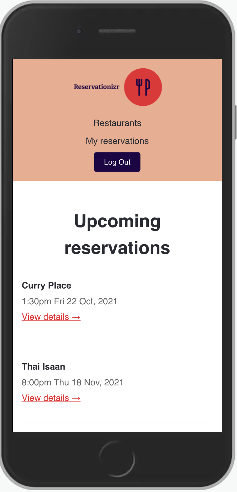

# Reservationizr - Manage Reservations

  <h3 style="bold">Reservationizr</h3>
  

## Technologies used

- React - 
- Javascript - 
- HTML - 
- CSS - 
- Auth0 - <picture><source media="(prefers-color-scheme: light)" srcset="https://cdn.auth0.com/website/sdks/logos/auth0_light_mode.png" height="30">
    <source media="(prefers-color-scheme: dark)" srcset="https://cdn.auth0.com/website/sdks/logos/auth0_dark_mode.png" height="30">
    </picture>
- MongoDB - 
- Heroku - 
- Express - 
- Nodejs - 

## Features

- Create a new reservation item
- Get reservations/reservation item by id
- Get restaurants/restaurant item by id

# Getting started

The `client` folder contains the React Application, and the `server` folder contains the Express application.

## Client

- In a new Terminal window, type: `cd client` to change directory into the client folder
- Type `npm install` to install npm dependencies
- Type `npm start` to start the React Application

## Server

- In a new Terminal window, type: `cd server` to change directory into the server folder
- Type `npm install` to install npm dependencies
- Type `npm start` to start the Express Server

## MongoDB Database

- In a new Terminal, type `docker-compose up` to start the MongoDB server in a Docker container
- Connect to MongoDB using [MongoDB Compass](https://www.mongodb.com/products/compass). Create a database named `mongo`, a collection named `restaurants`, and load data from the [data](./data) folder into the database.

# Architecture diagrams

---

# API specification

To view the documentation for the API specification:

1. Open a Terminal in VS Code for this project
2. Type `cd server` to change directory into the server folder
3. Type `npm run docs` to start a web server with API documentation
4. Open the link displayed in your browser (it's automatically copied to your clipboard)

   

## Load the API Specification in Insomnia

You can automatically load all the available endpoints in Insomnia.

Watch the [video tutorial](https://www.loom.com/share/dfaf8b47c6924f5ba04ce84dd1bdea1b), or follow the instructions below:

1. Go to the Insomnia Dashboard
2. Click the purple `Create` button
3. Select `File`.
4. Navigate into this exercise folder, and choose `server/e2e/api-spec.yml`.
5. Import as a `Request Collection`.
6. You can then open the Reservationizr API 1.0 Collection. Insomnia will load the endpoints for you.
